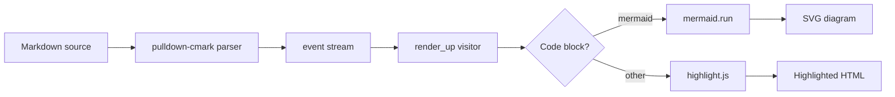
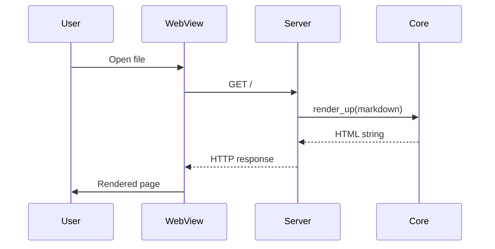
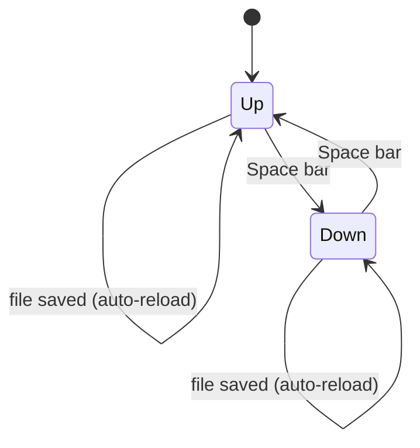

Feature showcase
===============================================================================

mudl renders GitHub-Flavored Markdown with a set of extended features beyond
the CommonMark baseline. This document demonstrates all of them in one place.


## Inline formatting

Standard inline markup: **bold**, _italic_, _**bold and italic**_,
~~strikethrough~~, and `inline code`.

Emoji shortcodes resolve to Unicode using GitHub's gemoji database (~1,800
aliases): :rocket: :sparkles: :tada: :white_check_mark: :warning:

mudl renders Markdown the way GitHub does, right on your Linux desktop.


## Syntax highlighting

Code blocks with a language tag are highlighted client-side in the WebView by
a bundled copy of highlight.js — no network requests, no external
dependencies. `mudl-core` itself only emits plain, escaped text tagged with a
`language-X` class; the browser does the actual coloring at page-load time.

```swift
struct Renderer {
    func render(_ markdown: String) -> String {
        let doc = MarkdownParser.parse(markdown)
        var visitor = UpHTMLVisitor()
        visitor.visit(doc)
        return visitor.result
    }
}
```

```python
from pathlib import Path

def render_file(path: Path) -> str:
    text = path.read_text(encoding="utf-8")
    return markdown.markdown(text, extensions=["tables", "fenced_code"])
```

```sh
mudl -u README.md > output.html            # full page, rendered (Up) mode
mudl -f -u README.md                       # fragment only, no <html> wrapper
```


## Math

Three forms are recognized, the same three GitHub accepts. A fenced code block
tagged `math`:

```math
\zeta(s) = \sum_{n=1}^{\infty} \frac{1}{n^s}
```

A paragraph wrapped in `$$…$$`:

$$ \int_0^\infty e^{-x^2}\,dx = \frac{\sqrt{\pi}}{2} $$

And inline math, written `` $`…`$ ``, which sits in a line of prose: the
Pythagorean theorem $`a^2 + b^2 = c^2`$, or Euler's identity
$`e^{i\pi} + 1 = 0`$.

The backticks are required — a bare `$…$` is not math — so a price like $5, or
a shell variable written `$PATH`, stays literal.

Anything Temml can typeset works, matrices and multi-case definitions included.

```math
A = \begin{pmatrix}
a_{11} & a_{12} & \cdots & a_{1n} \\
a_{21} & a_{22} & \cdots & a_{2n} \\
\vdots & \vdots & \ddots & \vdots \\
a_{m1} & a_{m2} & \cdots & a_{mn}
\end{pmatrix}
```

```math
f(n) = \begin{cases}
  n / 2      & \text{if } n \text{ is even} \\
  3n + 1     & \text{if } n \text{ is odd}
\end{cases}
```


## Task lists

- [x] CommonMark baseline (headings, lists, links, images)
- [x] GFM tables
- [x] GFM task lists
- [x] GFM strikethrough
- [x] GFM alerts (note, tip, important, warning, caution)
- [x] DocC asides
- [x] Status asides
- [x] Mermaid diagrams
- [x] Math (TeX typeset to MathML)
- [x] Syntax highlighting via highlight.js
- [x] Emoji shortcodes
- [x] YAML frontmatter
- [ ] Change tracking (planned — Phase 13)
- [ ] Footnotes (planned — Phase 14)
- [ ] Comments (planned — Phase 14)


## Tables

GFM tables support per-column text alignment using `:` in the separator row.

| Feature          | Syntax               | Status              |
| ---------------- | :------------------: | -------------------: |
| Alerts           | `> [!NOTE]`          | ✓                    |
| Mermaid diagrams | ```` ```mermaid ```` | ✓                    |
| Math             | ```` ```math ````    | ✓                    |
| Syntax highlight | ```` ```swift ````   | ✓                    |
| Emoji shortcodes | `:shortcode:`        | ✓                    |
| Task lists       | `- [ ]`              | ✓                    |
| Strikethrough    | `~~text~~`           | ✓                    |
| DocC asides      | `> Note: …`          | ✓                    |
| Status asides    | `> Status: …`        | ✓                    |
| Frontmatter      | `---` … `---`        | ✓                    |
| Change tracking  | —                     | planned (Phase 13)  |
| Footnotes        | `text[^1]`           | planned (Phase 14)  |
| Comments         | `[^comment-1]`       | planned (Phase 14)  |


## Footnotes

On GitHub, and in `mud`, a footnote reference like `[^label]` links to a
definition kept at the bottom of the document, with a back-link to return to
your place in the text. **mudl doesn't parse footnote syntax yet** — it's
planned for Phase 14 of the implementation plan, alongside the comments
feature that builds on it (see `docs/IMPLEMENTATION-PLAN.md`, §20). Today, a
reference like `[^1]` renders as literal bracketed text[^1], not a linked
footnote — see `docs/examples/footnotes.md` for the full syntax fixture this
will be verified against once Phase 14 lands.


## Comments

`mud` recognizes a comment as a footnote whose label starts with `comment-`,
and shows it in a margin column beside the quoted passage it annotates,
rather than in the footnote list at the bottom. This is planned for mudl as
Phase 14 of the implementation plan and is not implemented yet — and because
footnote parsing itself is also a Phase 14 item (see above), a
`comment-`-labeled reference like this one[^comment-b] doesn't even render as
an ordinary footnote today; it's literal bracketed text like any other
unparsed footnote syntax.

Because a comment is just a footnote, it'll survive untouched in any tool
that doesn't know the convention once both land. On GitHub it renders as an
ordinary footnote.


## Alerts

GFM alert syntax (`> [!TYPE]`) produces colour-coded call-outs with Octicon
icons.

> [!NOTE]
> Highlights information that users should take into account, even when
> skimming.

> [!TIP]
> Optional information to help a user be more successful.

> [!IMPORTANT]
> Crucial information necessary for users to succeed.

> [!WARNING]
> Critical content demanding immediate user attention due to potential risks.

> [!CAUTION]
> Negative potential consequences of an action.

Alerts can also contain rich content — code blocks, lists, inline formatting,
and links:

> [!TIP]
> Press **Space** to toggle between Up mode (rendered) and Down mode (raw
> source) without losing your scroll position.


### DocC asides

DocC-style asides use a word-and-colon prefix instead of the GFM `[!TYPE]` tag.
Both syntaxes produce the same icon and colour scheme.

> Note: Use DocC style in documentation comments rendered by Xcode.

> Tip: The outline sidebar lists all headings. Click any entry to jump to
> that section.

> Warning: Modifying the file outside mudl while it is open may cause the file
> watcher to miss the final change event on some filesystems.


### Status asides

A blockquote starting with `Status:` renders as a special call-out — used in
plan documents to track progress.

> Status: Complete
>
> All features in this document are implemented and shipping.


## Diagrams

Fenced code blocks with `mermaid` as the language identifier are rendered as
diagrams using the Mermaid library.


### Rendering pipeline




### Request lifecycle




### Mode states




## Change tracking

Change tracking — tinted overlays and gutters marking inserted, deleted, and
modified content; word-level diffs; a changes sidebar; and git-aware
"waypoints" to diff against — is planned for mudl as Phase 13 of the
implementation plan and is not implemented yet. See
`docs/IMPLEMENTATION-PLAN.md`, §19, for the full design.

[^1]: This is a footnote. The marker above is a superscript number; this
    definition is collected here at the foot of the document.

[^rich]: Footnote bodies can hold rich Markdown — `inline code`, **bold**,
    _italic_, links, and even short lists:

    - first point
    - second point

[^comment-b]: > a footnote whose label starts with `comment-`

    💬 {Claude @ 2026-06-22 09:18:42}:

    This thread is defined by a footnote labelled `comment-b` — the label
    is a unique key that a future comments UI (Phase 14) would use to keep
    the thread anchored. Today, mudl just renders it as an ordinary
    footnote, exactly like this one.
